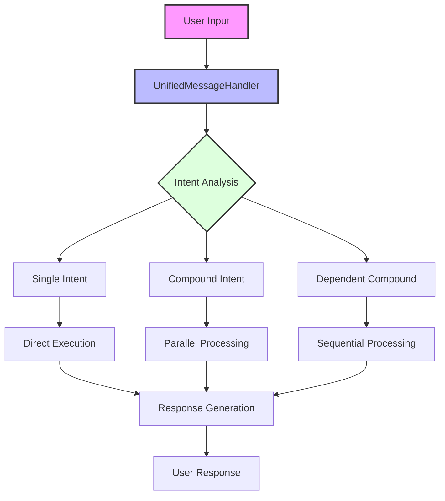
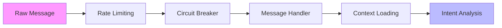
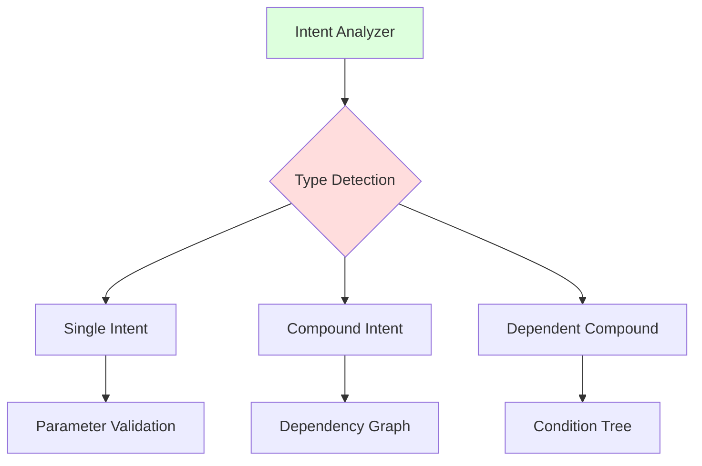
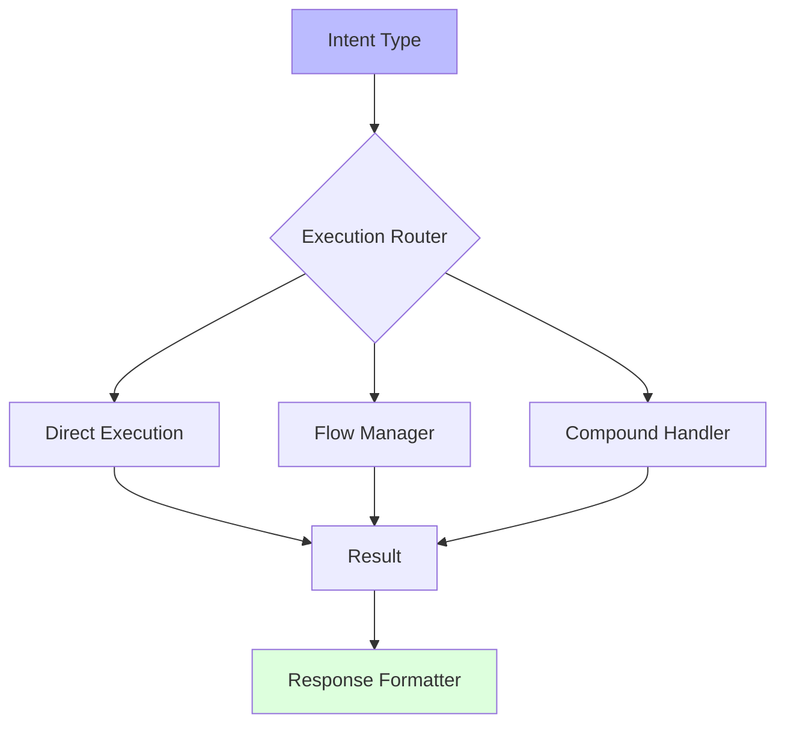
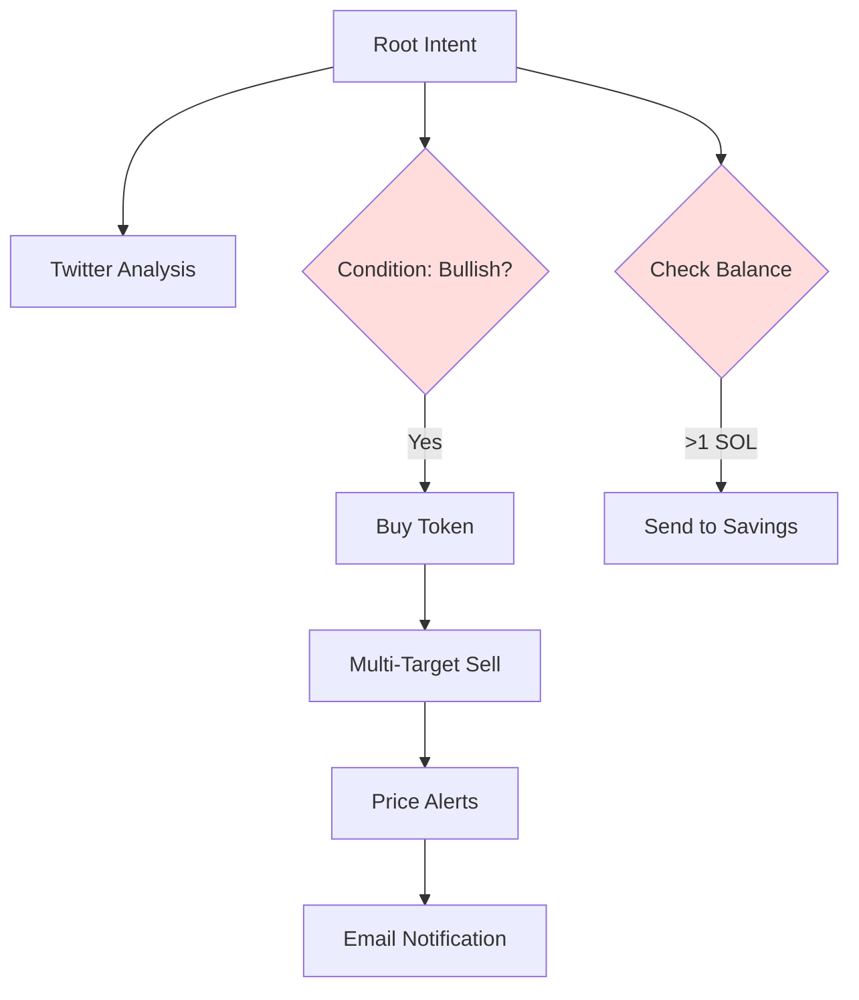
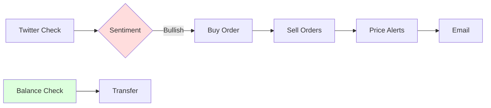
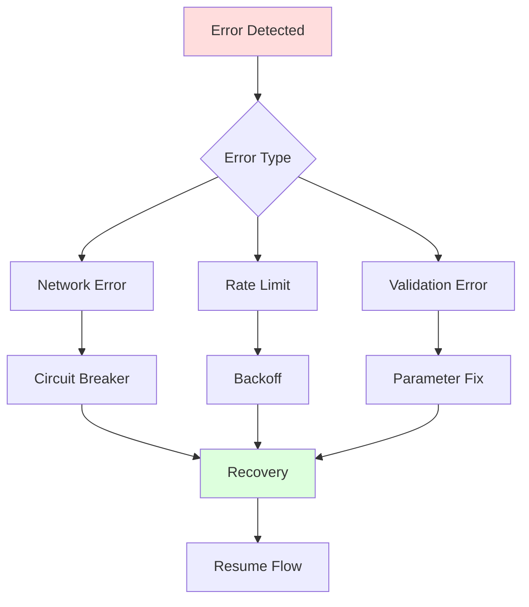

# KATZ Message Processing & Intent Analysis System 🧠

## Overview

KATZ employs a sophisticated multi-layer message processing system that combines natural language understanding, intent classification, and dynamic execution routing. The system handles everything from simple commands to complex conditional multi-step operations.

## Architecture Layers



## Message Flow Breakdown

### 1. Initial Message Reception 📥


### 2. Intent Analysis System 🔍


### 3. Execution Pipeline 🚀


## Example Flow Analysis

Let's analyze our complex example:
```
"check the sentiment of $BONK on twitter and if its bullish buy me 0.5 SOL, 
sell 50% of them when double and the rest when 200% up. 
Set price alerts for those targets, send me an email of the transaction 
confirmations to couragethetrenchdoggo@gmail.com. If my wallet/portfolio balance is 
more than 1 SOL send 1 SOL to my savings wallet from the address book."
```

### Intent Breakdown Tree 🌳


### Dependency Chain 🔗


## Key Components

### 1. UnifiedMessageHandler
- Rate limiting & circuit breaking
- Command registry integration
- WebSocket management
- Error handling & recovery

### 2. IntentAnalyzer
- Natural language parsing
- Intent classification
- Parameter extraction
- Dependency detection

### 3. DependentCompoundHandler
- Condition evaluation
- Sequential execution
- Result propagation
- State management

### 4. Flow Manager
- Multi-step operations
- User interaction handling
- Progress tracking
- State persistence

## Parameter Preparation Example

For our complex example, the `prepareParameters` function handles:

```javascript
// Initial Twitter sentiment check
{
  type: "KOL_CHECK",
  parameters: {
    cashtag: "BONK",
    metric: "sentiment"
  }
}

// Conditional buy based on sentiment
{
  type: "TOKEN_TRADE",
  parameters: {
    action: "buy",
    amount: "0.5",
    token: "BONK",
    unit: "SOL"
  },
  dependsOn: ["KOL_CHECK"],
  conditions: {
    type: "sentiment",
    operator: "==",
    value: "bullish",
    source: "KOL_CHECK.sentiment"
  }
}

// Multi-target sell orders
{
  type: "MULTI_TARGET_ORDER",
  parameters: {
    token: "BONK",
    targets: [
      { percentage: 50, multiplier: 2 },
      { percentage: 50, multiplier: 3 }
    ]
  },
  dependsOn: ["TOKEN_TRADE"]
}

// Price alerts
{
  type: "PRICE_ALERT",
  parameters: {
    token: "BONK",
    targets: [
      { price: "$result.TOKEN_TRADE.price * 2" },
      { price: "$result.TOKEN_TRADE.price * 3" }
    ]
  },
  dependsOn: ["TOKEN_TRADE"]
}

// Email notification
{
  type: "BUTLER_REMINDER",
  parameters: {
    email: "couragethetrenchdoggo@gmail.com",
    content: "Transaction confirmations: $result.TOKEN_TRADE.hash"
  },
  dependsOn: ["TOKEN_TRADE"]
}

// Balance check & transfer
{
  type: "PORTFOLIO_VIEW",
  parameters: {
    metric: "total_balance"
  }
},
{
  type: "SEND_TOKEN",
  parameters: {
    amount: "1",
    unit: "SOL",
    recipient: "$address.savings"
  },
  dependsOn: ["PORTFOLIO_VIEW"],
  conditions: {
    type: "balance",
    operator: ">",
    value: 1,
    source: "PORTFOLIO_VIEW.total_balance"
  }
}
```

## Error Handling & Recovery



## Performance Optimization

- Parallel execution of independent intents
- Result caching for repeated references
- Batched updates for progress notifications
- Smart retry mechanisms with exponential backoff

## Monitoring & Metrics

- Intent execution success rates
- Processing time per intent type
- Error rates and types
- Resource utilization
- User interaction patterns

This system provides enterprise-grade message processing with robust error handling, sophisticated intent analysis, and seamless execution of complex multi-step operations.